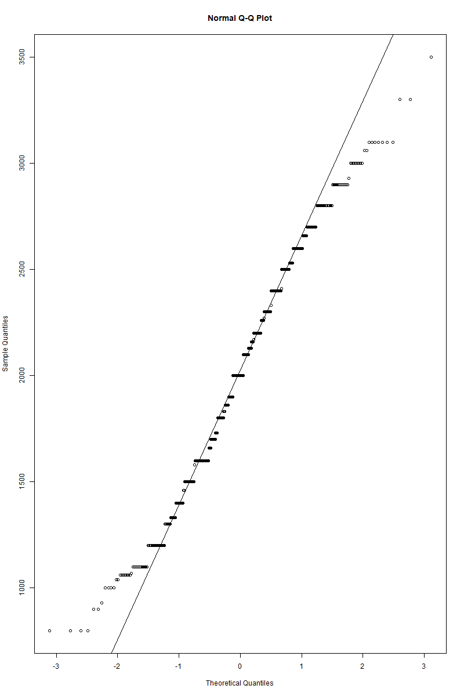
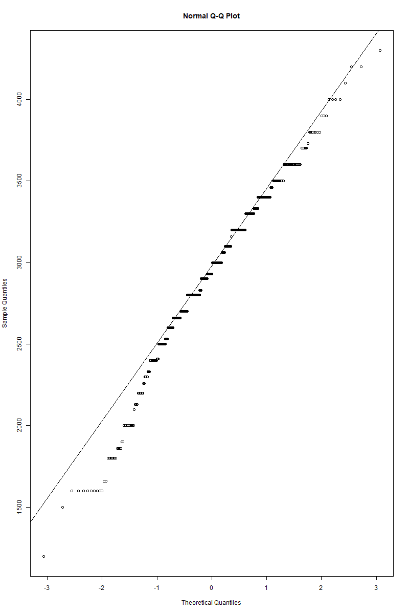
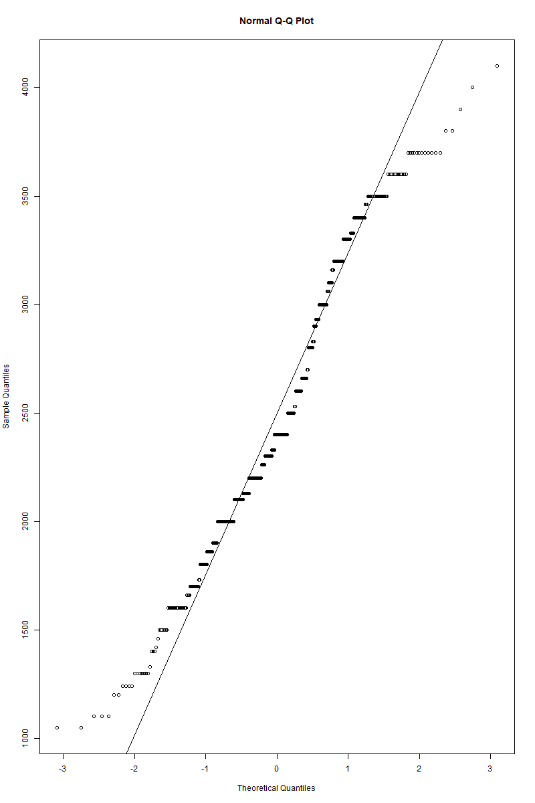
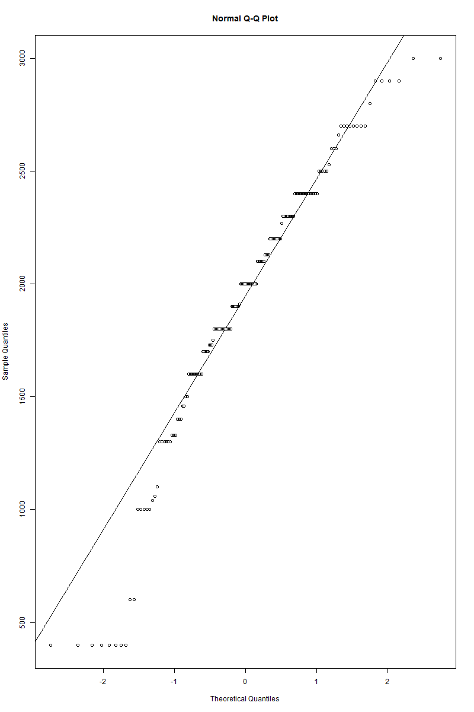
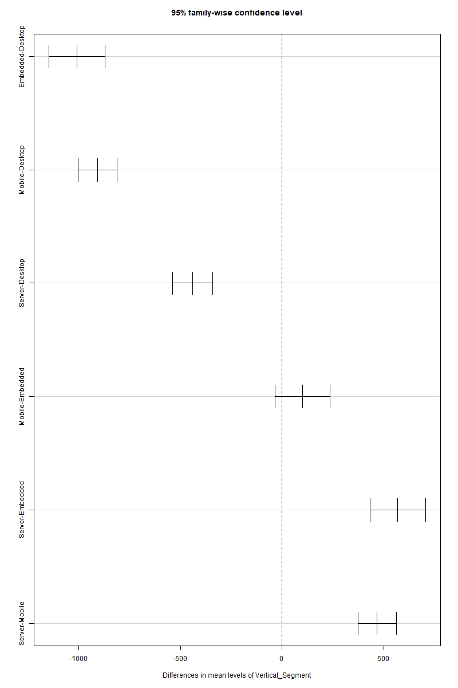

# ANOVA

## 5.1 Bài toán phân tích phương sai ANOVA

### 5.1.1. Đặt vấn đề

Giả sử ta cần kiểm tra xem có sự khác biệt về giá trị trung bình của Processor Base Frequency giữa các 4 nhóm CPU của Mobile, Desktop, Emmbeded và Server không. Để giải quyết vấn đề này, ta sẽ sử dụng phân tích phương sai ANOVA.

Đặt bài toán:

> H0: Không có sự khác biệt về giá trị trung bình của Processor Base Frequency giữa các nhóm CPU. (u(Desktop) = u(Mobile) = u(Server) = u(Embedded))
>
> H1: Có sự khác biệt về giá trị trung bình của Processor Base Frequency giữa các nhóm CPU. (Tồn tại u(i) != u(j) với i, j = Desktop, Mobile, Server, Embedded)

### 5.1.2. Phân tích ANOVA

Tải các thư viện cần thiết:

```r
if (!require(nortest)) install.packages("nortest")
library(nortest)

if (!require(car)) install.packages("car")
library(car)
```

#### a) Kiểm tra điều kiện phân phối chuẩn

Để có thể sử dụng kiểm định ANOVA, ta cần kiểm tra xem dữ liệu có tuân theo phân phối chuẩn không. Ta sẽ sử dụng đồ thị Q-Q Plot để quan sát và sử dụng kiểm định Shapiro-Wilk để kiểm tra chắc chắn điều này.

Đặt giả thuyết:

> H0: Dữ liệu tuân theo phân phối chuẩn
>
> H1: Dữ liệu không tuân theo phân phối chuẩn

```r
# Test 1: Normality of residuals for Mobile CPUs
mobileCPU <- subset(dataCPU, dataCPU$Vertical_Segment == "Mobile")
qqnorm(mobileCPU$`Processor_Base_Frequency(MHz)`)
qqline(mobileCPU$`Processor_Base_Frequency(MHz)`)
print(shapiro.test(mobileCPU$`Processor_Base_Frequency(MHz)`))

# Test 1: Normality of residuals for Desktop CPUs
desktopCPU <- subset(dataCPU, dataCPU$Vertical_Segment == "Desktop")
qqnorm(desktopCPU$`Processor_Base_Frequency(MHz)`)
qqline(desktopCPU$`Processor_Base_Frequency(MHz)`)
print(shapiro.test(desktopCPU$`Processor_Base_Frequency(MHz)`))

# Test 1: Normality of residuals for Server CPUs
serverCPU <- subset(dataCPU, dataCPU$Vertical_Segment == "Server")
qqnorm(serverCPU$`Processor_Base_Frequency(MHz)`)
qqline(serverCPU$`Processor_Base_Frequency(MHz)`)
print(shapiro.test(serverCPU$`Processor_Base_Frequency(MHz)`))

# Test 1: Normality of residuals for Embedded CPUs
embeddedCPU <- subset(dataCPU, dataCPU$Vertical_Segment == "Embedded")
qqnorm(embeddedCPU$`Processor_Base_Frequency(MHz)`)
qqline(embeddedCPU$`Processor_Base_Frequency(MHz)`)
print(shapiro.test(embeddedCPU$`Processor_Base_Frequency(MHz)`))

```



<center>Q-Q Plot cho Mobile CPUs</center>



<center>Q-Q Plot cho Desktop CPUs</center>



<center>Q-Q Plot cho Server CPUs</center>



<center>Q-Q Plot cho Embedded CPUs</center>
<br>
Dựa vào Q-Q plot, ta thấy các giá trị quan trắc (đã được chuẩn hóa) lệch so với đường màu xanh (đường chuẩn). Tuy nhiên, ta cũng cần kiểm tra chắc chắn bằng kiểm định Shapiro-Wilk.

```quote
        Shapiro-Wilk normality test

data:  mobileCPU$`Processor_Base_Frequency(MHz)`
W = 0.98262, p-value = 4.872e-06
```

Kết quả shapiro.test cho thấy dữ liệu có p-value = 4.872e-06 << 0.05 nên ta bác bỏ giả thiết H0, tức là dữ liệu tuân theo phân phối chuẩn.

#### b) Kiểm định tính đồng nhất về phương sai

Để có thể sử dụng kiểm định ANOVA, ta cần kiểm tra xem các nhóm có phương sai bằng nhau không. Ta sẽ sử dụng kiểm định Levent để kiểm tra điều này.

Đặt giả thuyết:

> H0: Các nhóm có phương sai bằng nhau
>
> H1: Có ít nhất một cặp nhóm có phương sai không bằng nhau

```R
levent_test <- leveneTest(dataCPU$`Processor_Base_Frequency(MHz)` ~ as.factor(dataCPU$Vertical_Segment))
print(levent_test)
```

```quote
Levene's Test for Homogeneity of Variance (center = median)
        Df F value    Pr(>F)
group    3  12.254 6.249e-08 ***
      1660
---
Signif. codes:  0 '***' 0.001 '**' 0.01 '*' 0.05 '.' 0.1 ' ' 1
```

Kết quả cho thấy p < 6.246e-8 << 0.05 nên ta bác bỏ giả thiết H0, tức là các nhóm có phương sai không bằng nhau.

#### c) Kiểm định ANOVA

Sau khi đã kiểm tra điều kiện phân phối chuẩn và tính đồng nhất về phương sai, dù không thỏa mãn điều kiện đầu, tuy nhiên, vì giới hạn trong phạm vi môn học, ta sẽ tiến hành kiểm định ANOVA và chỉ sử dụng kết quả để tham khảo.

```R
summary(anova_model)
```

```quote
                   Df    Sum Sq  Mean Sq F value Pr(>F)
Vertical_Segment    3 248144485 82714828     240 <2e-16 ***
Residuals        1660 572009730   344584
---
Signif. codes:  0 '***' 0.001 '**' 0.01 '*' 0.05 '.' 0.1 ' ' 1
```

Vì p-value < 2.10^-16 << 0.05 nên ta bác bỏ giả thiết H0, tức là có sự khác biệt về giá trị trung bình của Processor Base Frequency giữa các nhóm CPU.

#### d) Kiểm tra sự khác biệt giữa các nhóm

Để phân tích sự khác nhau cụ thể về means của các nhóm, ta sẽ sử dụng phương pháp Tukey HSD.

```R
TukeyHSD(anova_model)
plot(TukeyHSD(anova_model))
```

```quote
  Tukey multiple comparisons of means
    95% family-wise confidence level

Fit: aov(formula = `Processor_Base_Frequency(MHz)` ~ Vertical_Segment, data = dataCPU)

$Vertical_Segment
                       diff         lwr       upr     p adj
Embedded-Desktop -1008.4419 -1146.20336 -870.6804 0.0000000
Mobile-Desktop    -907.3239 -1002.92309 -811.7247 0.0000000
Server-Desktop    -439.9724  -537.32797 -342.6168 0.0000000
Mobile-Embedded    101.1180   -34.14041  236.3764 0.2189039
Server-Embedded    568.4695   431.96407  704.9750 0.0000000
Server-Mobile      467.3515   373.57136  561.1317 0.0000000
```



<p align="center"> Biểu đồ Tukey HSD </p>

<br/><br/>

Kết quả cho thấy có sự khác biệt đáng kể về giá trị trung bình của Processor Base Frequency giữa các nhóm CPU. Dựa vào giá trị diff của các cặp, ta nhận xét: giá trị trung bình của Embedded CPUs thấp hơn Desktop CPUs 1008.44 MHz, Mobile CPUs thấp hơn Desktop CPUs 907.32 MHz, Server CPUs thấp hơn Desktop CPUs 439.97 MHz. Trong khi đó, giá trị trung bình của Server CPUs cao hơn Embedded CPUs 568.47 MHz và Mobile CPUs 467.35 MHz.

Vậy có thể thấy Desktop CPUs có giá trị trung bình Processor Base Frequency cao nhất, tiếp theo là Server CPUs, Mobile CPUs và cuối cùng là Embedded CPUs.
